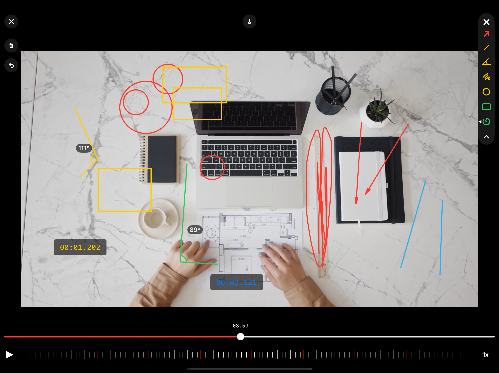
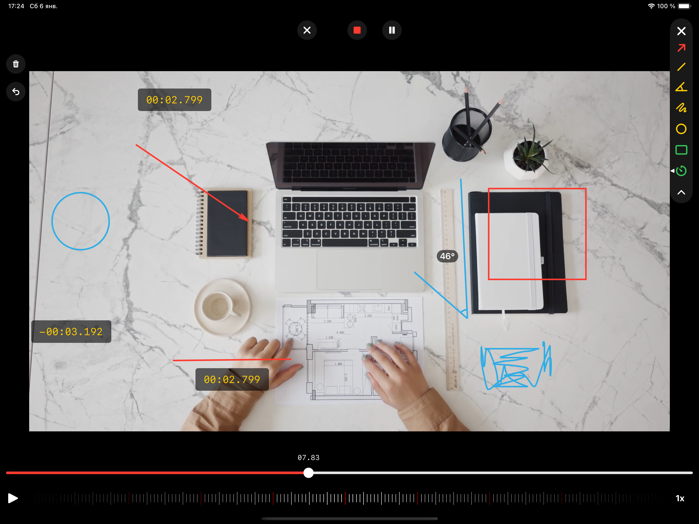
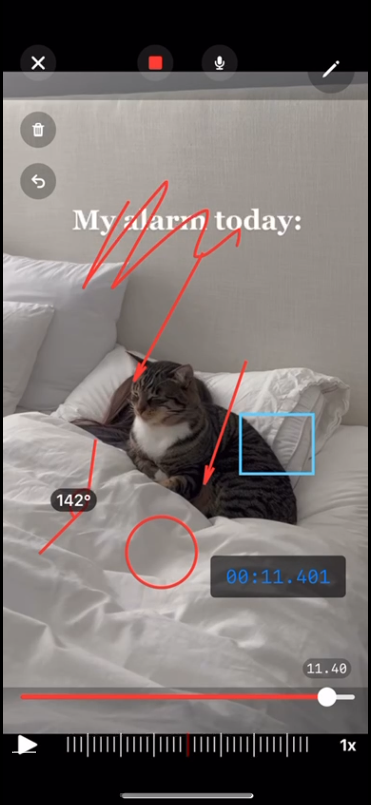
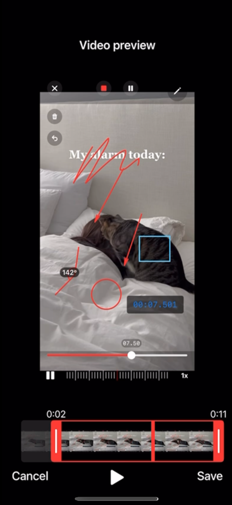

# Voice-Instruction-app

Screen recording and sketching application on top of a video layer

## Features
Possible features of the application:
1. **Overlaying layers on top of videos**: Users can add different layers, such as images or graphics, on top of their videos to enhance the visual effects.
2. **Drawing and creating shapes and arrows**: Users can freely draw on the video or create various shapes and arrows to highlight certain areas or provide additional information.
3. **Drawing angles**: Users can draw angles on the video to demonstrate specific measurements or angles in a visual and interactive way.
4. **Timer element overlay**: Users can add a timer element on top of the video, providing a visual representation of elapsed time or duration.
5. **Saving new videos**: Users can save the modified videos with added layers, drawings, and timers as a separate file.
6. **Recording voice during drawing**: Users can record their voice while they draw or annotate on the video, providing an additional explanation or commentary.
7. **Trimming the finished video**: Users can crop or trim the final video to remove unnecessary parts or focus on specific sections.
8. **Precise time scrolling**: Users can scroll through the video timeline with accuracy, allowing them to navigate to specific moments or frames within the video easily.
9. **Video speed**: Users can change the speed of the video

## Includes

- SwiftUI
- iOS 15+ iPad and iPhone
- MVVM
- Combine
- AVKit
- AVFoundation
- ReplayKit

## Screenshots 📷

 

 
      

       

 
            

                   

 
 
            

   
## Author
* [Bogdan Zykov](https://github.com/BogdanZyk)

###

